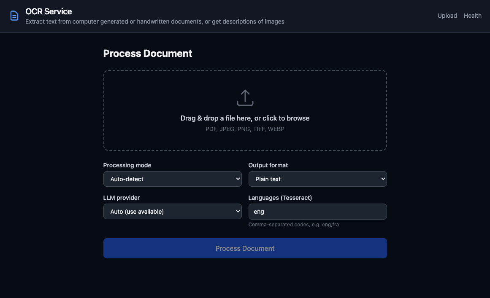

# OCR Service

Extract text from computer-generated or handwritten documents, or get descriptions of images.

A self-hosted document OCR service with a web UI, REST API, and folder watcher. Supports Tesseract for machine-printed text and local/cloud LLM vision models for handwriting and complex layouts.



---

## Features

- **Auto-detection** — classifies content as printed, handwritten, or mixed and routes to the best engine
- **Multiple OCR engines** — Tesseract (fast, machine text) + LLM vision (handwriting, complex layouts, image description)
- **LLM providers** — OpenAI GPT-4o, Azure OpenAI / AI Foundry, or a local Ollama model
- **Web UI** — drag-and-drop upload, side-by-side image/text view, word-level bounding box overlay (Tesseract), dark mode
- **REST API** — synchronous and async job submission, webhook callbacks, API key auth
- **Folder watcher** — drop files into a watched folder, results appear automatically
- **Multiple output formats** — plain text or Markdown
- **Multi-language** — Tesseract language packs for English, French, German, Spanish (extensible)

---

## Quick Start

### Prerequisites

- [Docker](https://docs.docker.com/get-docker/) and Docker Compose
- (Optional) [Ollama](https://ollama.com) for local LLM vision

### 1. Clone and configure

```bash
git clone https://github.com/Fybre/ocr.git
cd ocr
cp .env.example .env
```

Edit `.env` to configure your LLM provider (see [Configuration](#configuration)).

### 2. Start the service

```bash
docker compose up --build
```

The service starts on [http://localhost:8000](http://localhost:8000).

### 3. Create an API key

```bash
docker exec ocr-api python scripts/create_api_key.py --name mykey
```

Save the key — it's shown once.

---

## Web UI

Navigate to [http://localhost:8000](http://localhost:8000) to upload documents via drag-and-drop. No authentication required for the web UI.

- Select processing mode: **Auto**, **Machine text**, **Handwriting**, or **Image description**
- Choose output format: **Plain text** or **Markdown**
- Select LLM provider (unconfigured providers are greyed out)
- View results side-by-side with the source image
- Toggle word-level bounding box overlay (Tesseract jobs)

---

## REST API

All API endpoints require an `X-API-Key` header.

### Submit a job

```bash
curl -X POST http://localhost:8000/api/v1/jobs \
  -H "X-API-Key: your-key" \
  -F "file=@document.pdf" \
  -F "mode=auto" \
  -F "output_format=plain"
```

**Form fields:**

| Field | Default | Options |
|-------|---------|---------|
| `file` | — | PDF, JPEG, PNG, TIFF, WEBP, BMP |
| `mode` | `auto` | `auto` \| `machine` \| `handwriting` \| `image_description` |
| `output_format` | `plain` | `plain` \| `markdown` |
| `async_mode` | `false` | `true` \| `false` |
| `webhook_url` | — | URL to POST results to |
| `llm_provider` | `auto` | `auto` \| `local` \| `openai` \| `azure` |
| `languages` | `eng` | Tesseract language codes, comma-separated |

### Other endpoints

```
GET    /api/v1/jobs/{id}            Job status
GET    /api/v1/jobs/{id}/result     Full result (404 until done)
GET    /api/v1/jobs/{id}/download   Download result as file
GET    /api/v1/jobs                 List jobs
DELETE /api/v1/jobs/{id}
POST   /api/v1/jobs/{id}/reprocess  Re-run with same file

POST   /api/v1/keys                 Create API key
GET    /api/v1/keys                 List keys
DELETE /api/v1/keys/{id}

GET    /health                      Health check (unauthenticated)
```

### Webhook payload

When a job completes, the service POSTs JSON to your `webhook_url`:

```json
{
  "event": "job.completed",
  "job_id": "uuid",
  "status": "done",
  "filename": "scan.pdf",
  "engine_used": "TesseractEngine",
  "processing_mode": "auto",
  "output_format": "plain",
  "page_count": 3,
  "confidence_score": 87.4,
  "result_url": "http://localhost:8000/api/v1/jobs/{id}/result",
  "completed_at": "2026-04-22T12:00:00Z"
}
```

Retried up to 5 times with exponential backoff.

---

## Folder Watcher

Drop any supported file into `data/watch_input/`. The service picks it up automatically and writes results to `data/watch_output/`:

- `{filename}.txt` (or `.md`) — extracted text
- `{filename}.meta.json` — job metadata (engine, confidence, page count)

Configure defaults via environment variables:

```env
WATCH_DEFAULT_MODE=auto
WATCH_DEFAULT_FORMAT=plain
WATCH_DEFAULT_LANGUAGES=eng
```

---

## Configuration

Copy `.env.example` to `.env` and set the relevant values:

```env
# Local LLM via Ollama
LOCAL_LLM_BASE_URL=http://host.docker.internal:11434/v1
LOCAL_LLM_MODEL=qwen2.5vl:3b

# OpenAI
OPENAI_API_KEY=sk-...

# Azure OpenAI
AZURE_OPENAI_ENDPOINT=https://your-resource.openai.azure.com
AZURE_OPENAI_API_KEY=...
AZURE_OPENAI_DEPLOYMENT=gpt-4o

# OCR settings
OCR_CONFIDENCE_THRESHOLD=60   # Tesseract confidence below this uses LLM fallback
OCR_DPI=300

# Job retention
JOB_RETENTION_DAYS=30         # Set to 0 to disable cleanup
```

### Local LLM (Ollama)

Any Ollama vision model works. Recommended:

```bash
ollama pull qwen2.5vl:3b    # fast, low VRAM
ollama pull qwen2.5vl:7b    # higher quality
```

On Linux, Ollama on the host is reachable from Docker via `host.docker.internal` (the `extra_hosts` entry in `docker-compose.yml` handles this).

---

## Processing Modes

| Mode | Engine | Use for |
|------|--------|---------|
| `auto` | Classifier → Tesseract or LLM | Unknown documents |
| `machine` | Tesseract | Printed/typed text |
| `handwriting` | LLM vision | Handwritten documents |
| `image_description` | LLM vision | Photos, diagrams, screenshots |

In `auto` mode, a lightweight classifier (your local vision model) detects whether content is printed, handwritten, or mixed, then routes accordingly. If no LLM is configured, Tesseract confidence scoring is used as fallback.

---

## Data

All data is stored in a Docker volume mounted at `/data`:

```
data/
├── ocr.db          SQLite database
├── uploads/        Uploaded files + page thumbnails
├── results/        (reserved)
├── watch_input/    Drop files here for folder watcher
└── watch_output/   Folder watcher results appear here
```

---

## Development

```bash
# Run without Docker
pip install -r requirements.txt
uvicorn app.main:app --reload

# Run tests
pytest tests/
```

---

## License

MIT
